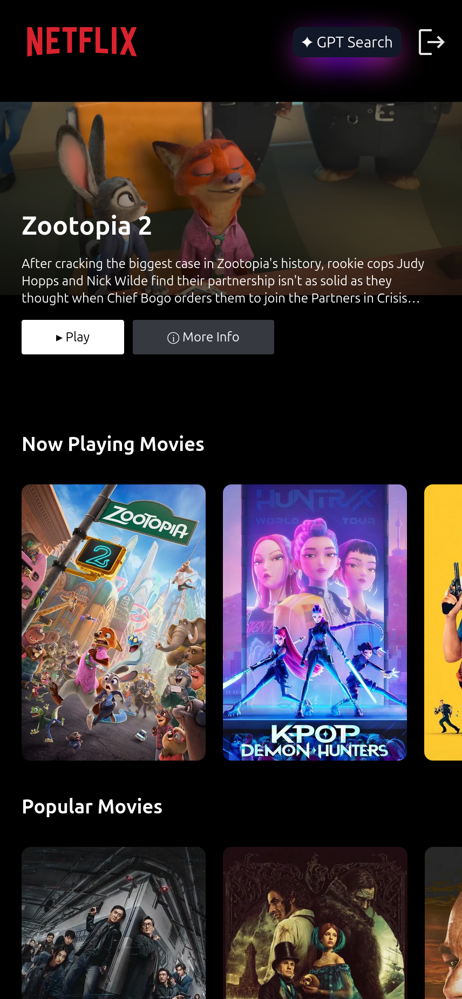
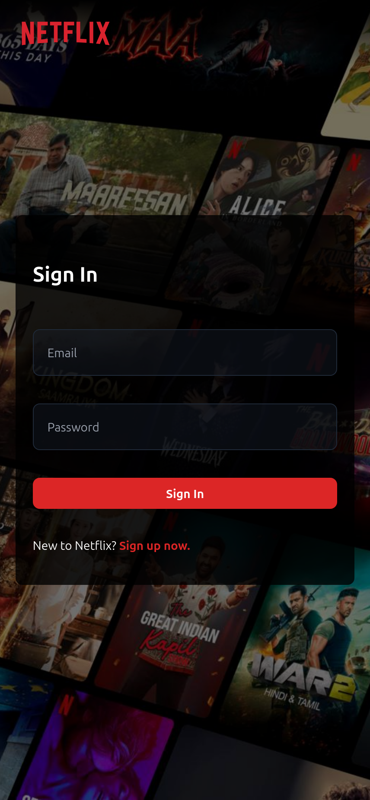
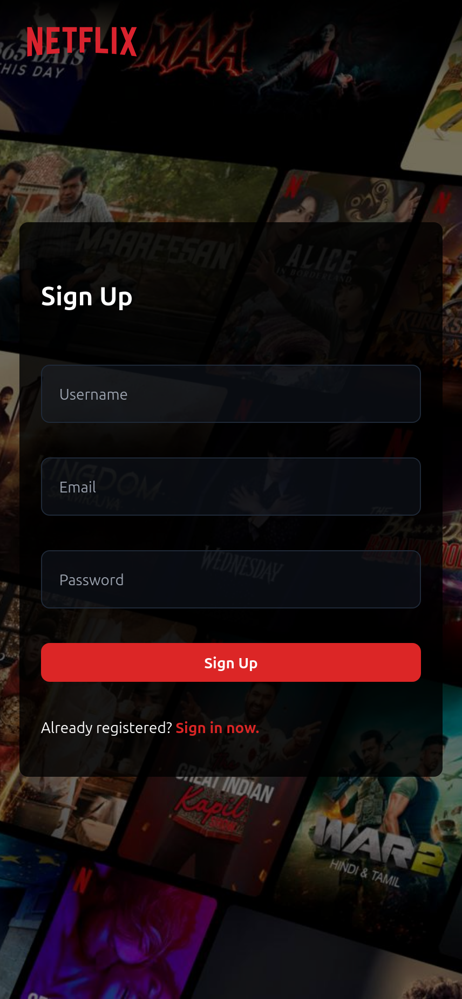
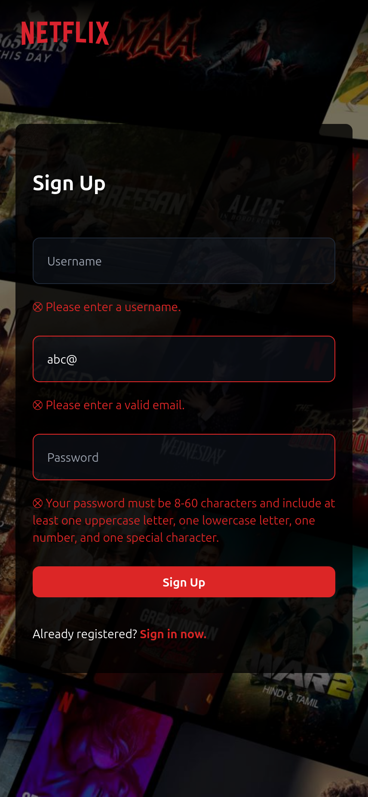
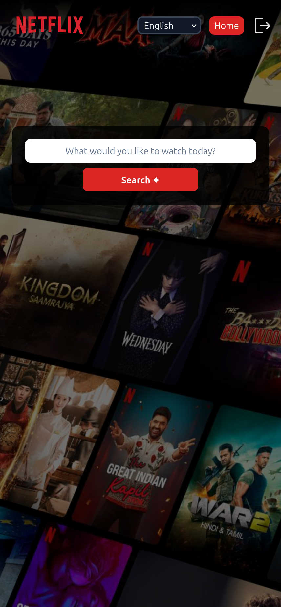

<div align="center">

# 🎬 NetflixAI

### AI-Powered Movie & TV Show Discovery Platform

[](https://developer.mozilla.org/en-US/docs/Web/JavaScript)
[](https://reactjs.org/)
[](https://tailwindcss.com/)
[](https://redux.js.org/)
[](https://firebase.google.com/)

[Live Demo](https://netflixai-dd03f.web.app/) · [Report Bug](https://github.com/sd704/NetflixAI/issues) · [Request Feature](https://github.com/sd704/NetflixAI/issues)

---

**A modern, full-stack Netflix clone powered by AI-driven search capabilities, featuring real-time movie/TV show data and intelligent recommendations.**

</div>

---

## 📸 Screenshots

### 🏠 Home Page - Dynamic Content Discovery
<div align="center">

| Desktop View | Tablet View | Mobile View |
|:---:|:---:|:---:|
|  |  |  |
| Browse curated collections | Responsive layout | Touch-optimized interface |

</div>

### 🔐 Authentication - Secure Sign In/Sign Up
<div align="center">

| Sign In | Sign Up | Validation |
|:---:|:---:|:---:|
|  |  |  |
| Firebase authentication | User registration | Real-time form validation |

</div>

### 🎥 Movie/Show Details - Rich Media Experience
<div align="center">

| Trailer Player | More Info Modal | Category Browsing |
|:---:|:---:|:---:|
|  |  |  |
| Embedded YouTube trailers | Detailed information | Multiple categories |

</div>

### 🤖 AI-Powered Search - Intelligent Discovery
<div align="center">

| GPT Search Interface | Language Selection | Search Results |
|:---:|:---:|:---:|
|  |  |  |
| Natural language queries | Multi-language support | AI-curated results |

</div>

---

## 🚀 Features

### 🎯 Core Features
- **Dynamic Content Delivery** - Real-time movie and TV show data from TMDB API
- **AI-Powered Search** - Intelligent search using Groq API (GPT-4-turbo-128k model)
- **Secure Authentication** - Firebase-based user management with validation
- **Responsive Design** - Seamless experience across all devices
- **Trailer Integration** - Instant trailer playback for any title

### 🎬 Content Categories

**Movies:**
- 🔥 Now Playing
- ⭐ Popular Movies
- 🏆 Top Rated Movies

**TV Shows:**
- 📺 Airing Today
- 🌟 Popular Shows
- 🎖️ Top Rated Shows

### 🔍 Advanced Search Capabilities
- **Natural Language Processing** - Ask questions like "Show me action movies from 2023"
- **Multi-Language Support** - Search in your preferred language
- **Contextual Results** - AI understands intent and context
- **Detailed Information** - Click any tile for comprehensive details

---

## 🛠️ Tech Stack

### Frontend

- React 18 - Component-based UI architecture
- Redux Toolkit - Centralized state management
- Tailwind CSS - Utility-first styling
- JavaScript (ES6+) - Modern JavaScript features

### Deployment

- Firebase Hosting - Production deployment

---

## 📋 Prerequisites

Before running this project, ensure you have:

- Node.js (v14 or higher)
- npm or yarn
- Firebase account
- TMDB API key
- Groq API key

---

## ⚙️ Installation & Setup

### 1️⃣ Clone the Repository

```
git clone https://github.com/yourusername/netflixai.git
cd netflixai
```

### 2️⃣ Install Dependencies

```
npm install
```

### 3️⃣ Configure Environment Variables

Create a `.env` file in the root directory:

Firebase Configuration
```
REACT_APP_FIREBASE_API_KEY=your_firebase_api_key
REACT_APP_FIREBASE_APP_ID=your_firebase_app_id
```
TMDB API Configuration
```
REACT_APP_TMDB_API_KEY=your_tmdb_api_key
```
Groq API Configuration
```
REACT_APP_GROQ_API_KEY=your_groq_api_key
```

### 4️⃣ Run the Development Server
```
npm start
```

The app will open at `http://localhost:3000`

### 5️⃣ Build for Production
```
npm run build
```

### 6️⃣ Deploy to Firebase

Update firebase config in `utils/firebase.js`

```
firebase login
firebase init hosting
firebase deploy
```

---

## 🔑 Key Features Breakdown

### 🔐 Authentication System

- Email/Password authentication
- Real-time form validation
- Error handling & user feedback
- Protected routes
- Session persistence

### 🎬 Content Management

- Dynamic API integration
- Category-based browsing
- Caching strategy with Redux

### 🤖 AI Search Engine

- Natural language processing
- Context-aware recommendations
- Multi-language query support
- Fallback handling


---

## 🎨 Design Highlights

- **Netflix-inspired UI** - Familiar, intuitive interface
- **Smooth Animations** - Tailwind transitions for polished feel
- **Responsive Grid** - Adaptive layouts for all screen sizes
- **Dark Theme** - Eye-friendly viewing experience

---

## 🌐 API Integration

### TMDB API
This project uses [The Movie Database (TMDB) API](https://www.themoviedb.org/documentation/api) for all movie and TV show data.

**Attribution:**
> This product uses the TMDB API but is not endorsed or certified by TMDB.

**TMDB Endpoints Used:**
```
/movie/now_playing // Currently in theaters
/movie/popular // Popular movies
/movie/top_rated // Top rated movies
/tv/airing_today // TV shows airing today
/tv/popular // Popular TV shows
/tv/top_rated // Top rated TV shows
/movie/{id}/videos // Trailers and clips
```

### Groq API
AI-powered search using [Groq](https://groq.com/) with the `openai/gpt-4-turbo-128k` model for intelligent content discovery.

---

## 🐛 Known Issues

- The TMDB API may not be accessible on all ISPs, which can result in no data loading for some users.

---

## 🤝 Contributing

Contributions are welcome! Please follow these steps:

1. Fork the repository
2. Create your feature branch (`git checkout -b feature/AmazingFeature`)
3. Commit your changes (`git commit -m 'Add some AmazingFeature'`)
4. Push to the branch (`git push origin feature/AmazingFeature`)
5. Open a Pull Request

---

## 👨‍💻 Developer

**Your Name**

- GitHub: [@sd704](https://github.com/sd704)
- LinkedIn: [Profile](https://linkedin.com/in/sagar-dutta-007/)

---

## 🙏 Acknowledgments

- **[TMDB](https://www.themoviedb.org/)** - For providing comprehensive movie and TV show data
- **[Groq](https://groq.com/)** - For lightning-fast AI inference
- **[Firebase](https://firebase.google.com/)** - For authentication and hosting services
- **Netflix** - For design inspiration
- **React Community** - For excellent documentation and support

---

## 📊 Project Stats

- **API Integrations:** 3 (TMDB, Groq, Firebase)
- **Responsive Breakpoints:** 5 (mobile, tablet, laptop, desktop, 2K)

---

<div align="center">

### ⭐ Star this repo if you find it useful!

Made with ❤️ and React

</div>
